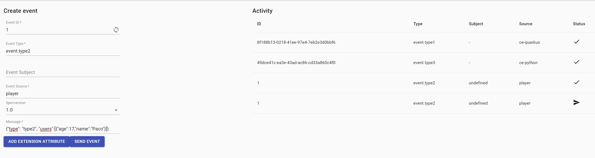

# Knative Eventing Cloudevents

### Requirements:

- You need to have knative-service and knative-eventing in your kubernetes:
    `kubectl get namespaces`
- Then, you should have a broker created named example-broker, if not you can create it with:
    `kn broker create example-broker`

### Steps:
1.  Create the cloudevents player:
`kn service create cloudevents-player -image quay.io/ruben/cloudevents-player:latest`
2.  Define a sink between the cloudevents player and the broker:
`kn source binding create ce-player-binding --subject "Service:serving.knative.dev/v1:cloudevents-player" --sink broker:example-broker`
3.  Deploy python service:
`cd knative-eventing-cloudevents-python`
`kn func build . -i dev.local/knative-eventing-cloudevents-python:latest`
`kubectl apply -f service.yaml`
`cd ..`
4.  Deploy quarkus service:
`cd knative-eventing-cloudevents-quarkus`
`kn func build . -i dev.local/knative-eventing-cloudevents-quarkus:latest`
`kubectl apply -f service.yaml`
`cd ..`
5.  Check that the services are running:
`kn service list`
6. Create the triggers:
`kn trigger create cloudevents-trigger --sink cloudevents-player  --broker example-broker`
`kn trigger create quarkus-trigger --sink ke-ce-quarkus  --broker example-broker --filter type=event.type3` 
`kn trigger create python-trigger --sink ke-ce-python  --broker example-broker --filter type=event.type2` 
7. Check that everything is ready:
`kn trigger list`
`kn source list`
`kn service list`

### Test:

1.  Go to your cloudevent player http page in your browser (you can check the endpoint with kn service list).
2.  Send a message of type event.type2.
`{"type": "type2", "users":[{"age":15,"name":"Luis"}]}`
you should see that the cloudevent player receive three different events:
-   The same even of type2 that it sent.
-   An event of type3, created by ce-python after receive the event of type 2.
-   An event of type1, created by ce-quarkus.
